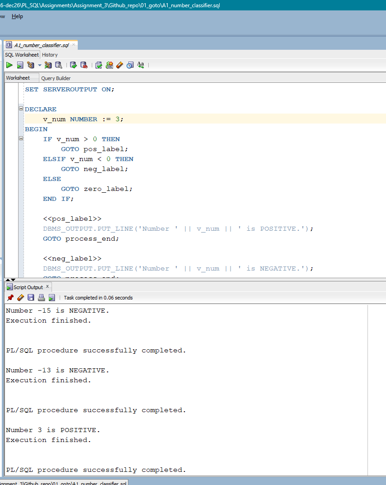
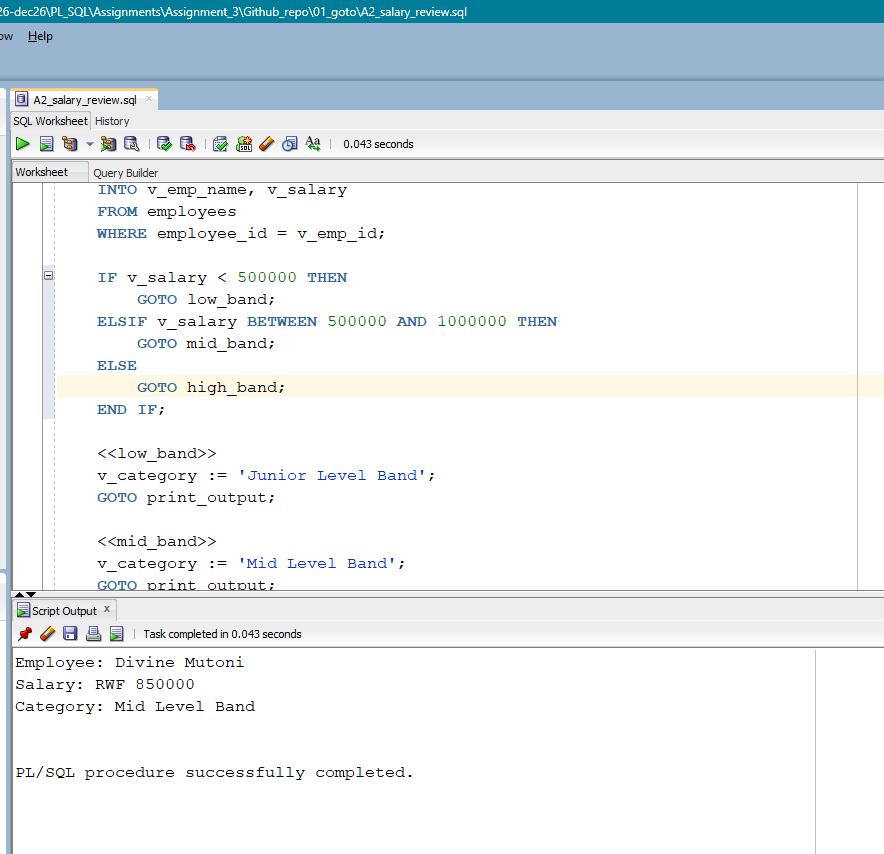
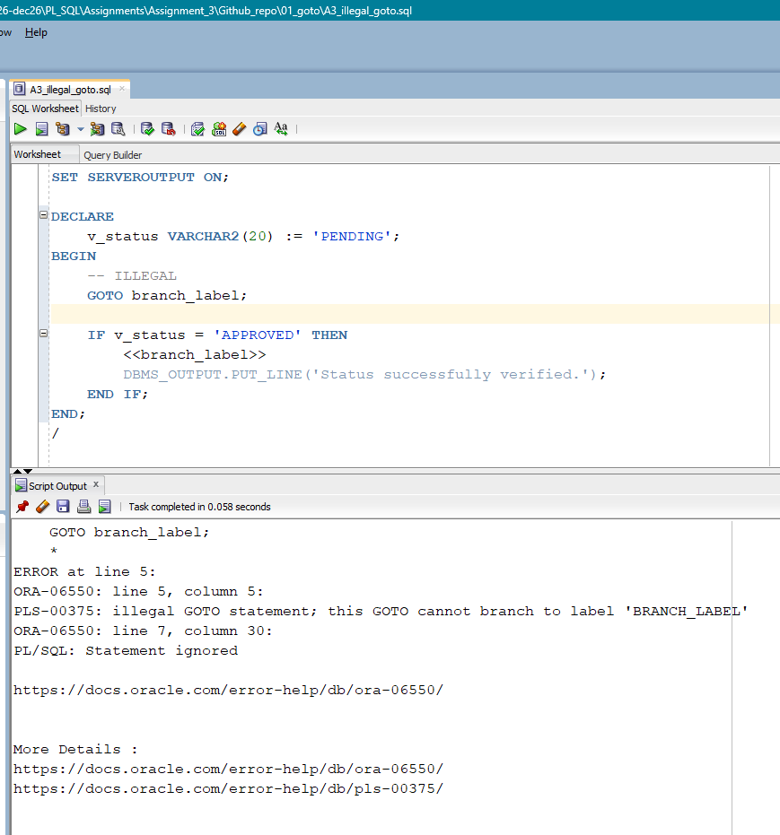
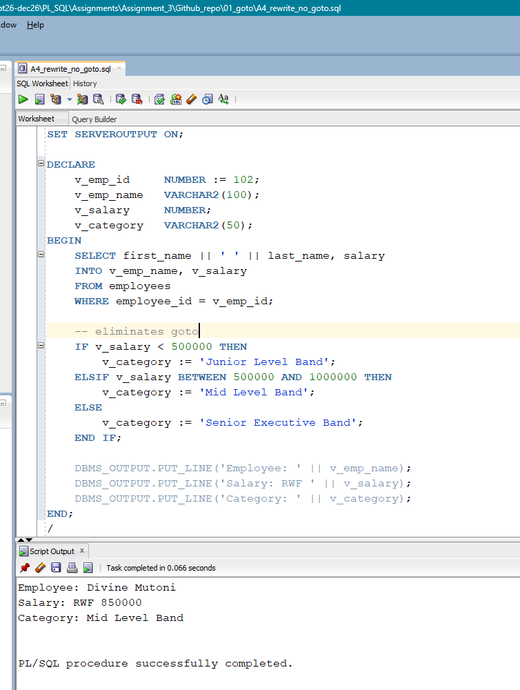
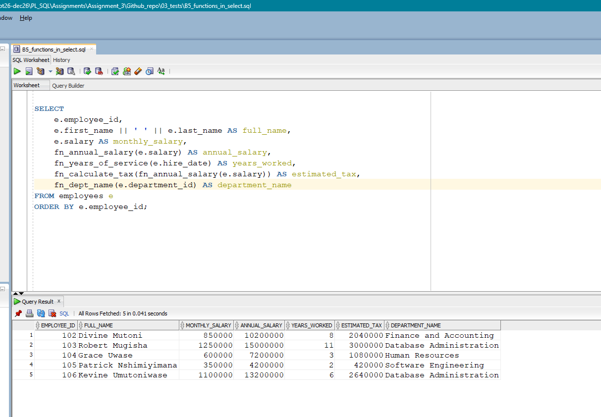
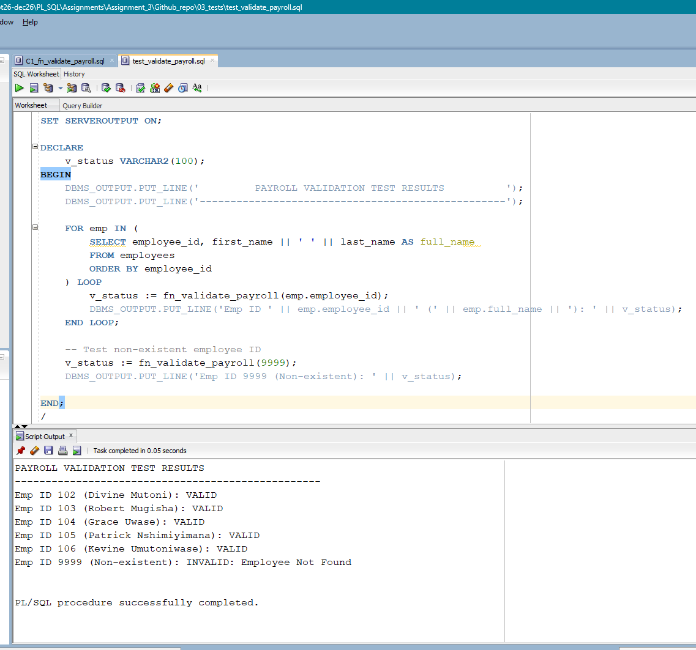

# PL/SQL Control Structures, Stored Functions & Payroll Validation

#### ID: 29136 ; Name: HEKIMA TOGEZE Constant

**Course:** Database Development with PL/SQL (INSY 8311)  
**Instructor:** Eric Maniraguha  


---

## 1. Overview of Tasks
This repository documents the implementation, compilation, testing, and documentation for **Assignment III**, covering PL/SQL control structures, stored functions, and automated database record validation in Oracle Database 21c.

The project encompasses four primary technical objectives:
1. **Control Flow Evaluation (Part A):** Implementation of PL/SQL `GOTO` statements, demonstrating scope restrictions (`PLS-00375`), and refactoring into structured conditional logic (`IF-ELSIF-ELSE`).
2. **Schema Stored Functions (Part B):** Development and compilation of persistent database functions (`fn_annual_salary`, `fn_years_of_service`, `fn_calculate_tax`, `fn_dept_name`) with embedded exception handling.
3. **SQL Integration (Part B5):** Invoking schema-level functions directly inside SQL `SELECT` projections across multi-table joins.
4. **Data Integrity & Payroll Validation (Part C):** Designing a defensive validation routine (`fn_validate_payroll`) to enforce business rules and foreign key consistency.

---

## 2. Repository Structure & Execution Flow

```text
plsql-goto-functions-29136-hekima/
├── README.md
├── .gitignore
├── 00_setup/
│   └── create_tables.sql
├── 01_goto/
│   ├── A1_number_classifier.sql
│   ├── A2_salary_review.sql
│   ├── A3_illegal_goto.sql
│   └── A4_rewrite_no_goto.sql
├── 02_functions/
│   ├── B1_fn_annual_salary.sql
│   ├── B2_fn_years_of_service.sql
│   ├── B3_fn_calculate_tax.sql
│   ├── B4_fn_dept_name.sql
│   └── C1_fn_validate_payroll.sql
├── 03_tests/
│   ├── B5_functions_in_select.sql
│   ├── test_functions.sql
│   └── test_validate_payroll.sql
├── screenshots/
│   ├── A1_output.png
│   ├── A2_output.png
│   ├── A3_error_and_fix.png
│   ├── A4_output.png
│   ├── B5_select_output.png
│   └── C1_output.png
└── docs/
    └── REFLECTION.md
```

### Execution Steps
1. **Initialize Database:** Run `00_setup/create_tables.sql` to build `departments` and `employees` tables and insert sample records.
2. **Compile Functions:** Run each script in `02_functions/` using **F5 (Run Script)** to store objects in the database dictionary.
3. **Run Control Flow Tests:** Execute scripts in `01_goto/` to evaluate `GOTO` branching vs. refactored conditionals.
4. **Execute Verification Tests:** Run scripts in `03_tests/` to confirm output formatting and validate automated payroll integrity checks.

---

## 3. Explanation of Tasks

### Task 1: Environment Setup & Table Population (`00_setup/`)
* **Objective:** Establish normalized tables (`departments`, `employees`) with primary and foreign key constraints, populating realistic test data.
* **Core DDL / DML:**
  ```sql
  CREATE TABLE departments (
      department_id   NUMBER PRIMARY KEY,
      department_name VARCHAR2(100) NOT NULL
  );

  CREATE TABLE employees (
      employee_id   NUMBER PRIMARY KEY,
      first_name    VARCHAR2(50) NOT NULL,
      last_name     VARCHAR2(50) NOT NULL,
      salary        NUMBER(12, 2) NOT NULL,
      hire_date     DATE NOT NULL,
      department_id NUMBER,
      CONSTRAINT fk_emp_dept FOREIGN KEY (department_id) 
          REFERENCES departments(department_id)
  );
  ```

---

### Task 2: GOTO Statements & Structured Refactoring (`01_goto/`)
* **Objective:** Explore label-based branching (`GOTO`), demonstrate compiler restriction rules on illegal jumps, and refactor logic into maintainable `IF-ELSIF-ELSE` blocks.
* **Files:**
  * `A1_number_classifier.sql`: Classifies positive, negative, and zero values using label jumps.
  * `A2_salary_review.sql`: Categorizes salary bands using branching labels.
  * `A3_illegal_goto.sql`: Triggers compiler error `PLS-00375` by jumping from an outer block into an `IF` statement.
  * `A4_rewrite_no_goto.sql`: Clean refactored logic eliminating `GOTO` statements.

* **Execution Proofs:**
  
  
  
  

---

### Task 3: Schema-Level Stored Functions (`02_functions/`)
* **Objective:** Create modular, reusable database functions that persist in the Oracle data dictionary.
* **Key Functions Implemented:**
  * `B1_fn_annual_salary.sql`: Converts monthly salary to annual gross pay (`p_monthly_sal * 12`).
  * `B2_fn_years_of_service.sql`: Computes completed service years via `MONTHS_BETWEEN(SYSDATE, hire_date) / 12`.
  * `B3_fn_calculate_tax.sql`: Calculates progressive tax brackets based on annual income.
  * `B4_fn_dept_name.sql`: Performs relational lookup for department names with `NO_DATA_FOUND` exception handling.
  * `C1_fn_validate_payroll.sql`: Validates record completeness, checking salary ranges, missing departments, and foreign key integrity.

---

### Task 4: Functional SQL Queries & Automated Testing (`03_tests/`)
* **Objective:** Query stored functions directly inside SQL `SELECT` projections and run unit test scripts against all compiled functions.
* **SQL Function Call Projection (`B5_functions_in_select.sql`):**
  ```sql
  SELECT 
      e.employee_id,
      e.first_name || ' ' || e.last_name AS full_name,
      e.salary AS monthly_salary,
      fn_annual_salary(e.salary) AS annual_salary,
      fn_years_of_service(e.hire_date) AS years_worked,
      fn_calculate_tax(fn_annual_salary(e.salary)) AS estimated_tax,
      fn_dept_name(e.department_id) AS department_name
  FROM employees e
  ORDER BY e.employee_id;
  ```

* **Execution Proofs:**
  
  

---

## 4. Challenges Faced & Solutions

1. **`ORA-00904: "FN_DEPT_NAME": invalid identifier`**
   * **Problem:** Running `B5_functions_in_select.sql` threw an invalid identifier error because the function script had been edited in SQL Developer but not compiled into the active schema.
   * **Fix:** Executed `B4_fn_dept_name.sql` using **F5 (Run Script)** to register the stored function object in `user_objects`.

2. **Uncompiled PL/SQL Buffer ("Task completed in X seconds")**
   * **Problem:** Running `CREATE OR REPLACE FUNCTION` scripts reported completed tasks without confirming object compilation.
   * **Fix:** Appended a terminating forward slash (`/`) on a new line at the end of every PL/SQL file to instruct SQL Developer to send the compiled block to the Oracle engine.

3. **`PLS-00375: illegal GOTO statement` Scope Violation**
   * **Problem:** Attempting to jump directly inside an `IF...THEN` block from an outer block in `A3_illegal_goto.sql` violated Oracle PL/SQL scope boundaries.
   * **Fix:** Demonstrated the illegal compiler restriction as required by the assignment, then refactored the logic into structured `IF-ELSIF` blocks in `A4_rewrite_no_goto.sql`.

4. **Client Substitution Variable Interruptions (`&`)**
   * **Problem:** Inserting string values containing ampersands (e.g., `'Finance & Accounting'`) caused SQL Developer to prompt for variable inputs.
   * **Fix:** Standardized text strings to `'Finance and Accounting'` or prepended setup scripts with `SET DEFINE OFF;`.

---

## 5. Integrity Statement & Academic Notes

I hereby declare that all database configurations, PL/SQL stored functions, control structure refactoring, automated unit test scripts, and execution screenshots documented in this repository represent my own work, executed and verified directly on my Oracle 21c environment.

* **AI Tool Usage Disclosure:** AI assistance was used responsibly for approximately **30%** of the project workflow (specifically for initial script, markdown document formatting, and diagnosing SQL Developer compilation errors).
* **Code Understanding:** All stored function implementations, SQL queries, and logic checks were independently verified and compiled by me. I retain complete ownership and full understanding of all submitted code.